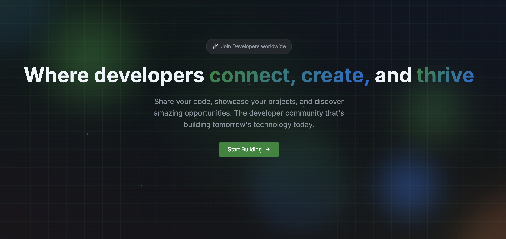

<div align="center">

<p align="center">
  <a href="#">
    
  </a>
</p>

</div>

> **Connecting developers through learning, collaboration, and community**

[](https://github.com/coder-connections)
[](https://github.com/coder-connections)
[](https://software-dev-engineer.pages.dev/)

## </> Coder-Connections

Coder-Connections is a GitHub organization dedicated to fostering a vibrant community of programmers who are passionate about learning, growing, and sharing knowledge in software development. We believe that the best way to learn is through collaboration, hands-on projects, and connecting with fellow developers.

## 🌟 What We Do ?

- **📚 Learning Resources**: Curated tutorials, guides, and educational content
- **🤝 Collaborative Projects**: Open-source projects that encourage participation from developers of all skill levels
- **💡 Knowledge Sharing**: Regular discussions, code reviews, and best practices
- **🚀 Skill Development**: Progressive projects that help developers grow from beginner to advanced
- **🌐 Community Building**: Connect developers worldwide through shared interests and goals

## 🚀 Getting Started

### For New Members

1. **Join the Organization**: Request to join our GitHub organization
2. **Introduce Yourself**: Create an issue in our welcome repository
3. **Explore Projects**: Browse our repositories and find something that interests you
4. **Start Contributing**: Pick a good first issue and make your first contribution
5. **Join Discussions**: Participate in our community discussions and code reviews

### For Contributors

1. **Fork & Clone**: Fork the repository you want to contribute to
2. **Make Changes**: Implement your feature or fix
3. **Test**: Ensure your changes work correctly
4. **Submit PR**: Create a pull request with a clear description

## 📁 Organization Structure

```
coder-connections/
├── learning-projects/          # Educational projects for different skill levels
├── community-tools/            # Tools that help the community
├── documentation/              # Organization documentation and guides
└── resources/                  # Learning resources and references
```

## 🎓 Developed By

[](https://tec.edu.my/)
[](https://maset.org.my/)

Lead Developer : <a href="https://github.com/AeroerMak"> Mohammed Asif </a>

*Developed for the Coder-Connections community*
